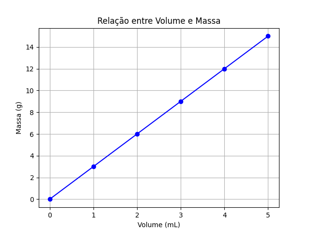

#+options: toc:2
#+startup: overview

* Pré-física

** Grandezas e Unidades de Medida

As grandezas físicas são conceitos aos quais podemos atribuir valores
numéricos, enquanto que as unidades de medida são padrões de medida para cada grandeza correspondente.

Na tabela abaixo estão algumas grandezas físicas com correspondentes unidades de medida:

#+CAPTION: Grandezas e unidades de medida.
| Grandeza    | Unidade (Nome)       | Unidade (Símbolo) |
|-------------+----------------------+-------------------|
| Massa       | Quilograma, Grama    | kg, g             |
| Volume      | Litro, Mili-litro    | L, mL             |
| Densidade   | Grama por mili-litro | g/mL              |
| Comprimento | Metro, Centímetro    | m, cm             |
| Tempo       | Hora, Segundo        | h, s              |

[[file:quest-pre-fisica1.org][Questões de Revisão: Grandezas e Unidades de Medida]] 

** Equações
*** Introdução
De forma simplificada, uma equação é uma relaçã de igualdade:

- Entre números

\(  2 + 2 = 4 \)

- Entre números e incôgnita

\(  2 + x = 4 \)

nesse caso o x tem apenas um valor possível;

- Entre números e variáveis

  \( x + y = 4 \)

  ou ainda

  \( x + y  = W \)

onde, nos dois últimos exemplos, temos um conjunto de valores que
satisfazem cada equação.
*** Equações e grandezas
As equações na física são relações matemáticas entre
grandezas. Considere os seguintes dados de uma substância hipotética:

#+CAPTION: Massa, volume e densidade
| Massa (g) | Volume (mL) | Densidade (g/mL) |
|-----------+-------------+------------------|
| 3,0       | 1,0         | 3,0              |
| 6,0       | 2,0         | 3,0              |
| \( ? \)   | 2,5         | 3,0              |
| 10,5      | \( ? \)     | 3,0              |
| 15,0      | 5,0         | \( ? \)          |

A densidade é calculada dividindo a massa pelo volume. Essa relação pode ser escrita como:

\begin{equation}
d = \frac{m}{V}
\end{equation}

Onde:
- \( m \) = massa
- \( V \) = volume
- \( d \) = densidade

Com dois valores conhecidos, podemos calcular o terceiro.

[[file:quest-pre-fisica2.org][Questões de revisão: equações]]
*** Equações e unidades de medida
As equações devem ser conpatíveis com as respectivas unidades de
medida, de modo que as unidades em um lado da equaçáo devem ser
correspondentes à do outro. E, ainda, nnão faz sentido somar números
em unidades diferentesl.

Exemplos

Não faz sentido somar 2 bananas com 2 tijolos (o resultado seria 4 o
quê?); e, se somarmos

\( 2 bananas + x = 4 bananas\)

x só pode ser um nómero de bananas também.

Essa ideia simples é útil, por exemplo, para fazer uma análise sobre
qual á a unidade de medida de uma grandeza em uma equação.
** Gráficos
Gráficos são ferramentas visuais importantes para representar dados e relações entre grandezas físicas. Eles ajudam a identificar padrões e tendências.

Como exemplo, os dados abaixo,

#+CAPTION: Massa e volume de uma substância hipotética
| Volume (mL) | Massa (g) |
|-------------+-----------|
| 1,0         | 3,0       |
| 2,0         | 6,0       |
| 3,0         | 9,0       |
| 4,0         | 12,0      |
| 5,0         | 15,0      |

Podem ser representados pela figura

#+CAPTION: Gráfico que relaciona os valores de massa e volume da tabela anterior.
#+ATTR_HTML: :alt Figura 1 :width 400px
#+ATTR_ORG: :align center

[[file:quest-pre-fisica3.org][Questões de revisão: gráficos]] 

** Grandezas diretamente proporcionais e grandezas inversamente proporcionais

Grandezas proporcionais são grandezas que crescem (ou descressem) na
mesma proporção. Ou seja, se uma delas dobra o seu valor, a outra
também dobra o seu valor. Se uma cresce triplica, a outra também
triplica o seu valor. Como exemplo, a relação entre a grandeza
distância percorrida e a grandeza tempo de percurso percorrida com uma
certa velocidade constante (valor fixo) de  20m/s) , representada na
tabela abaixo:

#+CAPTION: Exemplo de grandezas **diretamente proporcionais**: distância percorrida por tempo de percusso para uma velocidade constante
| Distância percorrida (m) | Tempo de percuso (s) |
|--------------------------+----------------------|
|                       20 | 1,0                  |
|                       40 | 2,0                  |
|                       80 | 4,0                  |
|                      100 | 5,0                  |

Podemos perceber que a razão entre os dois valores correspondentes se
mantêm:

\begin{equation*}
\frac{20}{1}=\frac{40}{2}=\frac{80}{4}=\frac{100}{5}
\end{equation*}

A notação matemática para essa correspondência de proporcionalidade
direta pode ser uma das três possibilidades abaixo:

\begin{equation}
d \sim t \qquad \text{ou} \qquad \frac{d}{t} = {constante}  \qquad \text{ou} \qquad \frac{d_1}{t_1}=\frac{d_2}{t_2}
\end{equation}

Onde:

\( d \) = Distância percorrida,

\( t \) = Tempo de percurso.

Já grandezas inversamente proporcionais são aquelas em que, quando uma cresce (aumenta), a outra decresce (diminui) na mesma proporção.
Como exemplo as grandezas velocidade e tempo decorrido para percorrer
uma distância fixa  de 20 m representadas na Tabela abaixo:

#+CAPTION: Exemplo de **grandezas inversamente proporcionais**: velocidade por tempo de percuso para uma mesma distância.
| Velocidade | Tempo para percorrer 20 m |
|------------+---------------------------|
| 1,0 m/s    | 20,0 s                    |
| 2,0 m/s    | 10,0 s                    |
| 5,0 m/s    | 4,0 s                     |
| 10,0 m/s   | 2,0 s                     |

Nesse caso podemos perceber que é o produto entre as grandezas que se
mantêm constante:

\begin{equation*}
1 \times 20 = 2\times 10 = 5 \times 4 = 10 \times 2
\end{equation*}

Temos as seguintes possíveis representações matemáticas para duas grandezas inversamente proporcionais:

\begin{equation}
v \sim \frac{1}{t} \qquad \text{ou} \qquad v\cdot t = \text{constante} \qquad \text{ou} \qquad v_1\cdot t_1 = v_2 \cdot t_2
\end{equation}

Onde:

\( v \) = velocidade,

e

\( t \) = Tempo de percurso.

[[file:quest-pre-fisica4.org][Questões de revisão: Grandezas diretamente proporcionais e grandezas inversamente proporcionais]]

** Operações com frações

*** Soma de frações

Para somar frações precisamos de um múltiplo comum. Em geral,
escolhemos o Mínimo Múltiplo Comum (m.m.c). Exemplo:

\[\frac{2}{3} + \frac{3}{2} = \frac{2\cdot 2 + 3 \cdot 3}{6} =\frac{4+9}{6}= \frac{13}{6}\]

*** subtração de frações

A subtração é análoga.

\[\frac{3}{4} - \frac{2}{3} = \frac{3\cdot 3 - 4\cdot 2 }{12}=\frac{1}{12}\]

*** Multiplicação de frações

\[\frac{3}{2}\cdot \frac{2}{3} = \frac {3\cdot 2}{2\cdot 3} = \frac{6}{6}=1\]

*** Divição de frações

\[ \frac{3}{4}:\frac{6}{2} = \frac{3}{4}\cdot\frac{2}{6}  =
\frac{1}{4}\cdot\frac{2}{2} = \frac{1}{4} \]

[[file:quest-pre-fisica5.org][Questões de revisão: operações com frações]]

** Potência de 10 e prefixos do SI

*** Potenciação

Definição: 
\(a^n = \underbrace{a \times a \times \cdots \times a}_{n \text{ vezes}}\), para \(n\) inteiro positivo. 
Onde \(a\) é a base e \(n\) é o expoente.

Exemplos:
- \(2^3 = 2 \times 2 \times 2 = 8\)
- \(5^2 = 25\)
- \(10^4 = 10 \times 10 \times 10 \times 10 = 10000\)

Casos especiais:
- \(a^1 = a\)
- \(a^0 = 1\) (para \(a \neq 0\))
- \(a^{-n} = \frac{1}{a^n}\) (para \(a \neq 0\))

*** Propriedades da potenciação

Para bases iguais, valem as seguintes propriedades:

- Multiplicação: \(a^m \cdot a^n = a^{m+n}\)
- Divisão: \(\frac{a^m}{a^n} = a^{m-n}\) (para \(a \neq 0\))
- Potência de potência: \((a^m)^n = a^{m \cdot n}\)
- Potência de produto: \((a \cdot b)^n = a^n \cdot b^n\)
- Potência de quociente: \(\left(\frac{a}{b}\right)^n = \frac{a^n}{b^n}\) (para \(b \neq 0\))

Exemplos:
- \(2^3 \cdot 2^4 = 2^{7} = 128\)
- \(\frac{3^5}{3^2} = 3^{3} = 27\)
- \((4^2)^3 = 4^{6} = 4096\)
- \((2 \cdot 5)^3 = 2^3 \cdot 5^3 = 8 \cdot 125 = 1000\)
- \(\left(\frac{2}{3}\right)^4 = \frac{2^4}{3^4} = \frac{16}{81}\)

*** Potência de dez

Potências de dez são usadas para representar números muito grandes ou muito pequenos de forma compacta.

\(10^n = 1\) seguido de \(n\) zeros, para \(n\) positivo.
\(10^{-n} = \frac{1}{10^n} = 0,\underbrace{00\ldots0}_{n-1 \text{ zeros}}1\)

Exemplos:
- \(10^3 = 1000\)
- \(10^6 = 1.000.000\) (um milhão)
- \(10^{-2} = 0,01\)
- \(10^{-5} = 0,00001\)

Notação científica: um número é escrito como \(a \times 10^n\), onde \(1 \leq a < 10\) e \(n\) é um inteiro.

Exemplos:
- \(3000 = 3 \times 10^3\)
- \(0,00045 = 4,5 \times 10^{-4}\)
- \(5.230.000 = 5,23 \times 10^6\)

*** Prefixos do SI

O Sistema Internacional de Unidades (SI) utiliza prefixos para denotar múltiplos e submúltiplos das unidades, baseados em potências de dez.

| Prefixo | Símbolo | Fator (potência de 10) | Exemplo               |
|---------+---------+------------------------+-----------------------|
| yotta   | Y       | \(10^{24}\)            | 1 Yg = 10^{24} g      |
| zetta   | Z       | \(10^{21}\)            | 1 Zg = 10^{21} g      |
| exa     | E       | \(10^{18}\)            | 1 Eg = 10^{18} g      |
| peta    | P       | \(10^{15}\)            | 1 Pg = 10^{15} g      |
| tera    | T       | \(10^{12}\)            | 1 Tg = 10^{12} g      |
| giga    | G       | \(10^{9}\)             | 1 Gg = 10^{9} g       |
| mega    | M       | \(10^{6}\)             | 1 Mg = 10^{6} g       |
| quilo   | k       | \(10^{3}\)             | 1 kg = 10^{3} g       |
| hecto   | h       | \(10^{2}\)             | 1 hg = 10^{2} g       |
| deca    | da      | \(10^{1}\)             | 1 dag = 10^{1} g      |
|         |         |                        |                       |
| deci    | d       | \(10^{-1}\)            | 1 dg = 10^{-1} g      |
| centi   | c       | \(10^{-2}\)            | 1 cg = 10^{-2} g      |
| mili    | m       | \(10^{-3}\)            | 1 mg = 10^{-3} g      |
| micro   | µ       | \(10^{-6}\)            | 1 µg = 10^{-6} g      |
| nano    | n       | \(10^{-9}\)            | 1 ng = 10^{-9} g      |
| pico    | p       | \(10^{-12}\)           | 1 pg = 10^{-12} g     |
| femto   | f       | \(10^{-15}\)           | 1 fg = 10^{-15} g     |
| atto    | a       | \(10^{-18}\)           | 1 ag = 10^{-18} g     |
| zepto   | z       | \(10^{-21}\)           | 1 zg = 10^{-21} g     |
| yocto   | y       | \(10^{-24}\)           | 1 yg = 10^{-24} g     |

Observação: os prefixos mais comuns no dia a dia são: quilo (k), mega (M), giga (G), tera (T), mili (m), micro (µ), nano (n), pico (p).

*** Exemplos de aplicação

- Um processador opera com frequência de 2,5 GHz. Isso significa \(2,5 \times 10^9\) Hz.
- A massa de um elétron é cerca de \(9,11 \times 10^{-31}\) kg.
- A distância entre a Terra e o Sol é aproximadamente \(1,5 \times 10^{11}\) m.

[[file:quest-pre-fisica6.org][Questões de revisão: potência de 10 e prefixos do SI]]

** Exemplo final: Compreendendo a segunda lei de Newton a partir das relações de proporcionalidade

Uma das equações mais importnates para a mecânica é a equação que
relaciona a massa, aceleração e força, que resulta da Segunda Lei de
Newton. De forma simplificada ela pode ser escrita assim:

\( F = m \cdot a \)

Ou, para analizarmos do ponto de vista da aceleração, reescrevemos

\( a = \frac{F}{m} \)

Aqui, podemos compreendê-la a partir das noções de proporcionalidade
aprendidas, considerando que a aceleração é proporcional a força,

\( a \sim F \)

e inversamente proporcional à massa:

\( a \sim \frac{1}{m}\)
