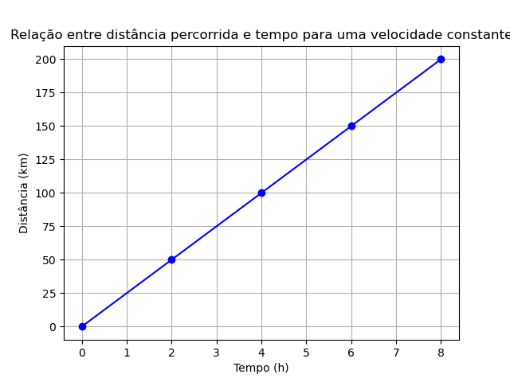
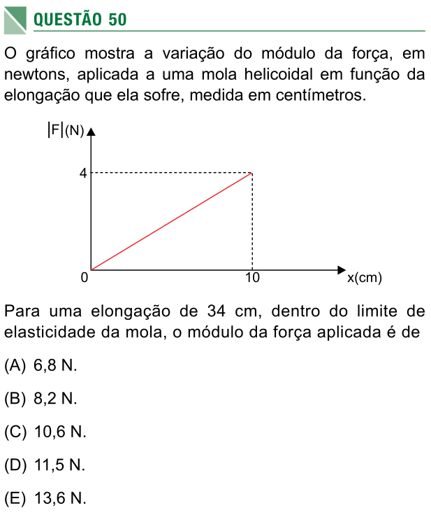
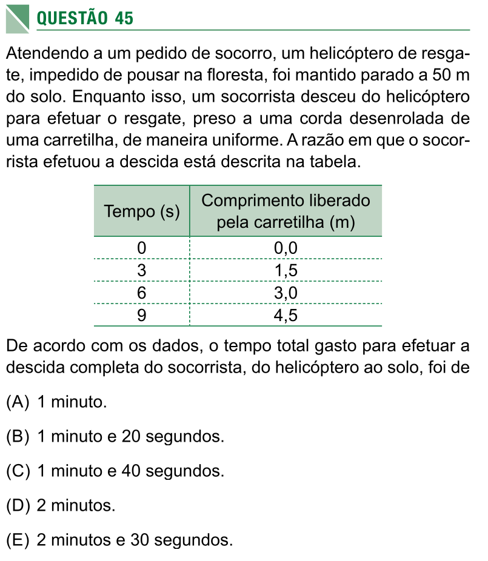

#+options: toc:2

* Orientações:
* Questão 1
* Questão 1
Associe corretamente cada grandeza da coluna A com a unidade de medida correspondente na coluna B. Escreva a letra da unidade ao lado do número da grandeza.

| Coluna A (Grandeza) | Coluna B (Unidade)              |
|---------------------+---------------------------------|
| 1. Massa            | a. °C (grau Celsius)            |
| 2. Temperatura      | b. kg (quilograma)              |
| 3. Densidade        | c. L (litro)                    |
| 4. Volume           | d. s (segundo) ou h (hora)      |
| 5. Tempo            | e. m (metro) ou km (quilômetro) |
| 6. Velocidade       | f. g/mL ou kg/L                 |
| 7. Distância        | g. km/h ou m/s                  |

*Exemplo: Massa é medida em kg, então 1 corresponde a b.*

* Questão 2

Um líquido tem volume de 500 mL e massa de 600 g.

a) Com esses dados, qual grandeza física você pode calcular? (Dica: é uma propriedade que relaciona massa e volume.)

b) Calcule o valor dessa grandeza e escreva o resultado com a unidade correta.

* Questão 3
Imagine um automóvel que se move de maneira uniforme (velocidade constante) durante 2 horas e percorre uma distância de 140 km.

a) De acordo com as grandezas da questão 1, qual delas pode ser calculada com esses dados?

b) Calcule essa grandeza e indique a unidade de medida.

* Questão 4
O mercúrio é um metal líquido com densidade de \(13,5\) g/mL.

a) Qual é a massa de 10 mL de mercúrio?

b) Qual é o volume ocupado por \(40,5\) g de mercúrio?

* Questão 5

Em um experimento, foram medidas massas e volumes de amostras de mel, e a densidade encontrada foi \(1,5\) g/mL.

a) Calcule o volume correspondente a uma massa de 10 g de mel.

b) Complete a tabela abaixo com quatro pares de valores (massa e volume) que sejam compatíveis com essa densidade.

Lembre-se:

\[ d = \frac{massa}{volume} \]

| Massa (g) | Volume (mL) |
|-----------+-------------|
|           |             |
|           |             |
|           |             |
|           |             |

* Questão 6

A velocidade média de um móvel é dada pela fórmula:

\[
v = \frac{d}{t}
\]

onde:
- \(v\) é a velocidade,
- \(d\) é a distância percorrida,
- \(t\) é o tempo gasto.

a) Qual é a velocidade de um carro que percorre 90 km em uma hora e meia? (Lembre-se: 1,5 h = 1 hora e meia.)

b) Mantendo essa mesma velocidade, quanto tempo o carro levaria para percorrer 210 km?

* gráfico - questões 7, 8 e 9

O gráfico abaixo será usado nas questões 7, 8 e 9.

#+CAPTION: Gráfico de distância em quilômetros por tempo em horas.
#+ATTR_HTML: :alt Figura 1 :width 500px
#+ATTR_ORG: :align center

* Questão 7

O gráfico acima representa o movimento uniforme de um carro em uma rodovia (distância percorrida em função do tempo).

a) Qual é a distância percorrida após 6 horas de viagem?

b) E após 3 horas?

c) Calcule a velocidade do carro usando a fórmula \(v = \frac{d}{t}\). Escolha um ponto do gráfico para fazer o cálculo.

* Questão 8

Com base no gráfico da questão 7, construa uma tabela relacionando a distância percorrida (em km) e o tempo (em h) para os instantes: 0 h, 2 h, 4 h, 6 h e 8 h.

| Tempo (h) | Distância (km) |
|-----------+----------------|
| 0         |                |
| 2         |                |
| 4         |                |
| 6         |                |
| 8         |                |

* Questão 9
a) Considere um segundo carro que se move com o dobro da velocidade do primeiro (da questão 7). No mesmo sistema de eixos (distância × tempo), desenhe o gráfico do movimento desse segundo carro, supondo que ele também parte do repouso (posição inicial zero).

b) Agora, imagine um terceiro carro com a mesma velocidade do segundo, mas que começa seu trajeto a 100 km do ponto de referência (ou seja, no instante \(t = 0\), sua posição é 100 km). Para ajudá-lo a construir o gráfico, preencha primeiro a tabela abaixo com as posições nos tempos indicados. Depois, desenhe o gráfico posição × tempo.

| Tempo (h) | Posição (km) |
|-----------+--------------|
| 0         | 100          |
| 2         |              |
| 4         |              |
| 6         |              |
| 8         |              |

*Dica: a posição aumenta com o tempo na mesma taxa (velocidade) do item (a).*

* Questão 10 - Questão 50 do SIS1/UEA-2016

#+CAPTION: Questão 50 do SIS1 - 2016 
#+ATTR_ORG: :width 400
 

* Questão 11 - Questão 45 do SIS1/UEA-2018

#+CAPTION: Questão 50 do SIS1 - 2016 
#+ATTR_ORG: :width 400
 
